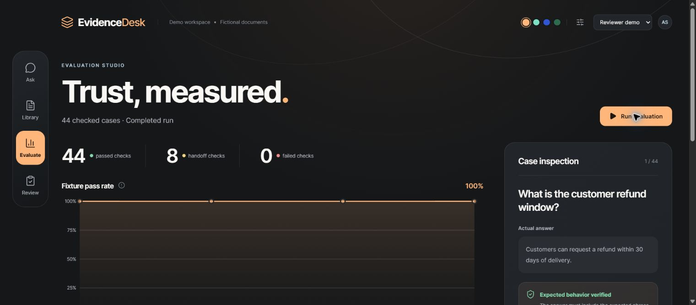
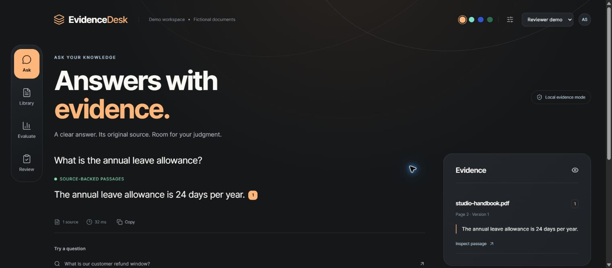
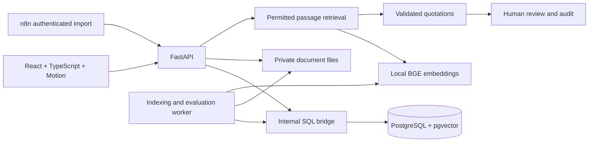

# EvidenceDesk

**Document answers you can inspect. Human decisions you can review. Quality you can measure.**

EvidenceDesk is a working document assistant with local semantic retrieval, exact source quotations, document versions, an approval queue, and a reproducible evaluation dashboard. Its Graphite & Tangerine interface uses a floating navigation rail, a spacious reading canvas, subtle motion, and a source inspector.



This is a portfolio demonstration using fictional policies and two selectable demo roles. It runs on your computer without a paid AI key. The default answer mode quotes retrieved text rather than generating a free-form answer. An optional OpenAI adapter selects validated quotations through the Responses API.

## Try it locally

Requires **Python 3.12** and **Node.js 22.16 or 24**. The pinned package manager is pnpm 11.25.0. First startup downloads a local embedding model, approximately 67 MB.

```sh
git clone https://github.com/Ayush-3000/evidencedesk-rag-evaluation.git
cd evidencedesk-rag-evaluation
python -m venv .venv
```

Activate the environment:

```powershell
# Windows PowerShell
.venv\Scripts\Activate.ps1
```

```sh
# macOS / Linux
source .venv/bin/activate
```

Then install and start:

```sh
python -m pip install -r requirements.lock
python -m pip install --no-deps -e .
npm install -g pnpm@11.25.0
pnpm install --frozen-lockfile
pnpm build
python scripts/run_demo.py
```

Open **http://127.0.0.1:8090**. The launcher starts the database bridge, API, and background worker, imports eight fictional documents, and queues the first evaluation. Stop with Ctrl+C. Ports 8090 and 8091 must be free; the launcher never stops unrelated services.

For a completely offline run, use `python scripts/run_demo.py --offline`. This explicitly uses lexical/hash retrieval and a separate database; it is not the semantic model. Semantic data lives in `runtime/semantic`, offline data in `runtime/offline`. Files, indexes, sessions, and generated integration tokens stay in the ignored `runtime` directory.

## A five-minute client demonstration

1. **Evaluate:** run the 44 cases and inspect a case's answer, expected behavior, and citations. Scores and latency come from the current run.
2. **Ask:** try “What is the customer refund window?” and open its numbered citation. Compare the quotation with the original document.
3. **Library:** upload a text PDF, TXT, or Markdown document. Upload a higher version with the same filename. The older version remains available until the replacement indexes successfully.
4. **Review:** ask “Can I return an item after 45 days?”, request human review, edit the draft, and approve it internally. Approval does not send a message.
5. **Access:** switch to Reader demo. Staff documents and reviewer workspaces become unavailable, including at the API and retrieval layer.
6. **Automation:** import the [n8n workflows](n8n/) and send a document through the authenticated API. Repeating identical content and version creates no duplicate import job.



## What is implemented

| Area | Working behavior |
|---|---|
| Interface | React, TypeScript, Motion, responsive layouts, four persistent themes, reduced motion, keyboard-dismissable source and upload dialogs |
| Ingestion | Text PDF page extraction, TXT/Markdown, LangChain splitting, queued indexing, error reporting and retry |
| Retrieval | FastEmbed local BGE embeddings, real pgvector distance search, PostgreSQL text ranking, permission filtering before ranking |
| Evidence | Exact quotations, document name/version/page, surrounding text and original file access |
| Human review | Explicit handoff, editable draft, optimistic version checks, internal approval, audit records |
| Evaluation | 44 fictional fixtures with visible phrase, source, status, access-boundary and quotation checks; actual latency and run history |
| n8n | Tested manual import and authenticated webhook exports; credential references, timeout, retry and idempotent imports |
| Persistence | PGlite embedded PostgreSQL for local setup; native PostgreSQL/pgvector through the same SQL bridge in Compose |

## Architecture



PGlite runs a real PostgreSQL engine and pgvector locally without requiring a Docker installation. The internal bridge is an implementation choice for this small demo, not a general public SQL API. It requires a separate random token and binds to loopback by default. Native PostgreSQL uses the same parameterized statements and transactions. See [architecture and limits](docs/architecture.md).

## Verification

```sh
python -m ruff check evidencedesk scripts tests
pnpm format:check
pnpm build
python -m pytest -q
# With the demo already running:
python scripts/smoke_demo.py
```

The local test suite uses real, isolated PostgreSQL/pgvector storage, an actual generated PDF, and HTTP requests. It covers duplicate and concurrent imports, version activation, failed imports and retry, session/access boundaries, stale approvals, job recovery, database restart, evaluation computation, concurrent evaluation creation, incompatible embedding modes, and rejecting invented model quotations.

The local semantic demo passed **44/44 fixture cases** and the integration suite passed **20 tests**. These fixtures are a transparent regression rubric, **not an independent accuracy benchmark or a promise of performance on unseen documents**. Saved results are in [docs/validation](docs/validation/). GitHub Actions checks both embedded and native PostgreSQL, and builds/runs the Compose stack in explicit offline mode.

## Containers and optional AI

For a loopback-only native PostgreSQL demo:

```sh
python scripts/create_compose_env.py
docker compose up --build -d --wait
```

Open the same URL, load the demo documents from Library, and run an evaluation. Keep the private `.env` file out of source control. Docker is optional; the normal launcher needs neither Docker nor a hosted database.

The standard launcher forces extractive mode and makes no paid model calls. To run the optional OpenAI adapter, configure `EVIDENCE_DRAFTER=openai`, `OPENAI_API_KEY`, and `OPENAI_MODEL` in the environments of the API and worker you start manually. The adapter returns source IDs and quotations under a strict schema; every quotation must occur in a permitted retrieved passage. Documents may then be sent to OpenAI. This adapter is covered by mocked contract tests; a live paid call has not been verified. Pricing is shown as unpriced in this mode, rather than inventing a dollar total. See [configuration](docs/configuration.md).

## Scope

This release is intended for local portfolio demonstrations. Demo roles are self-selected and are not production authentication. Before a hosted client deployment, add real identity and tenant isolation, secure document storage and retention, HTTPS, rate limits, managed migrations, larger-document ingestion, broader held-out evaluations, and operational monitoring. Scanned PDFs require OCR before upload. Static documents cannot answer live order questions. Human approval records a decision internally; external delivery is not implemented.

MIT licensed application code. Dependency licenses, including the embedding model and n8n, remain their own. All included documents, business identifiers, and example email addresses are fictional.
